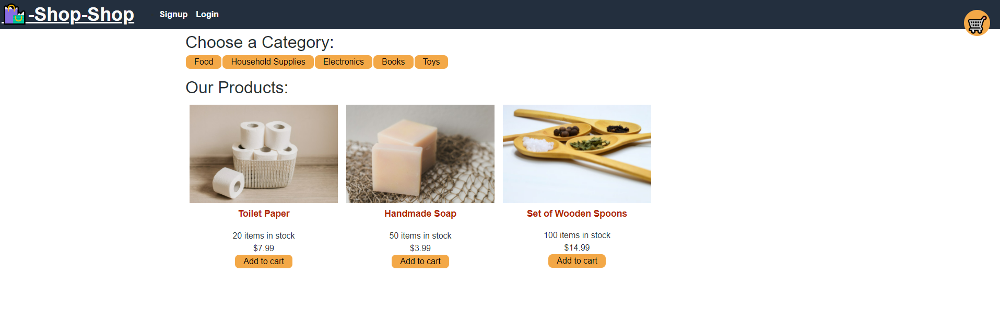
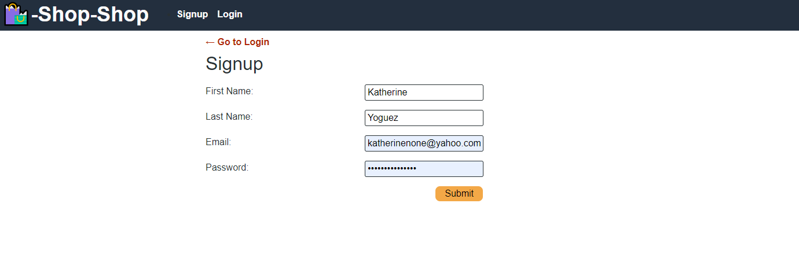
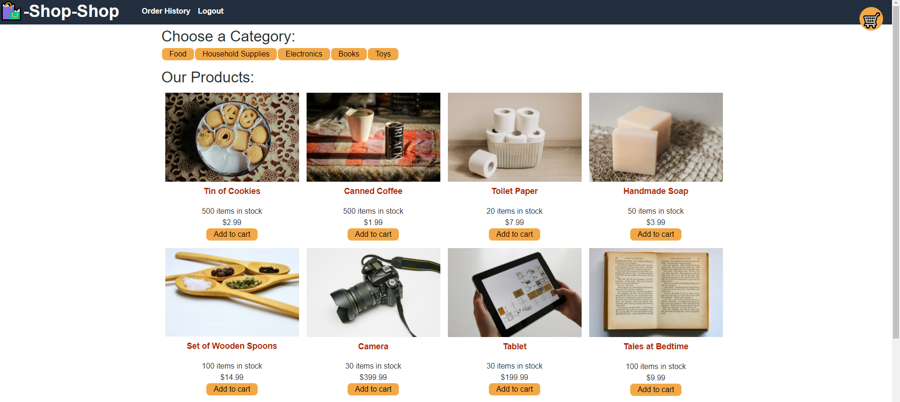
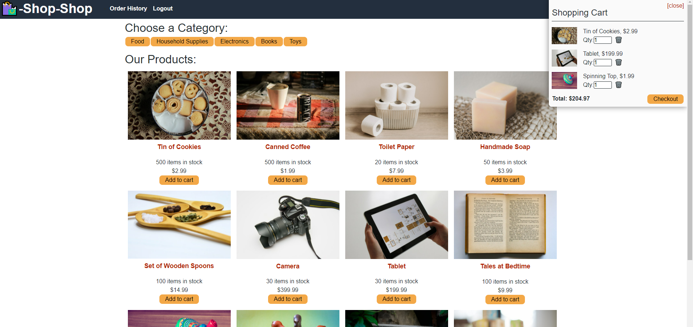
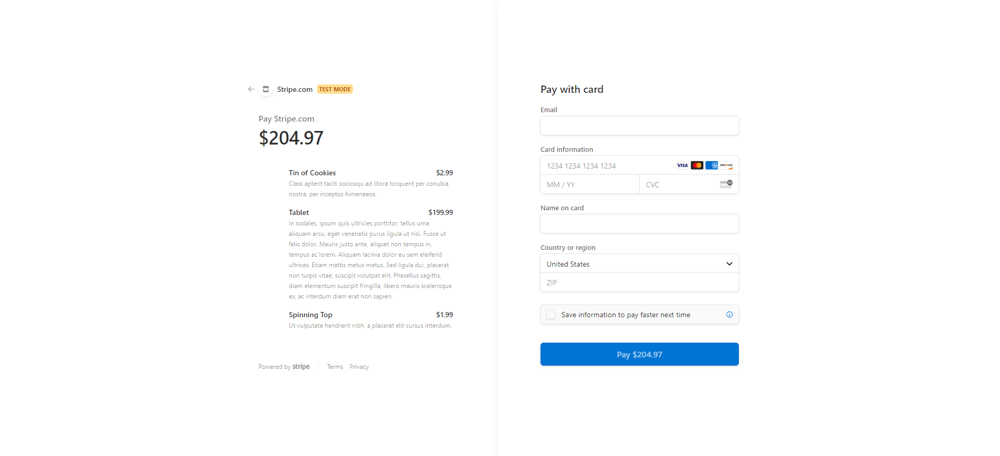

# ReduxStore

## **Project Summary** ⚡️

_E-commerce website that uses Redux to manage global state instead of Contect API so that the website's state management is taken out of the React ecosystem._

__________________________________________________________________________________________________________________________________________________

## **Tools Used** 🛠️

* React App
* Redux
* Mongoose
* Express
* Apollo-Sever
* Node.js
* GraphQL
* Heroku
* Json Web Token
* Bcrypt

___________________________________________________________________________________________________________________________________________________

## **Website** 📷

___________________________________________________________________________________________________________________________________________________

## **Recourses** 💡

[Katherine Y : Github](https://github.com/katherineyoguez/ReduxStore)

[Heroku : Live App](https://vast-headland-80627.herokuapp.com/)

____________________________________________________________________________________________________________________